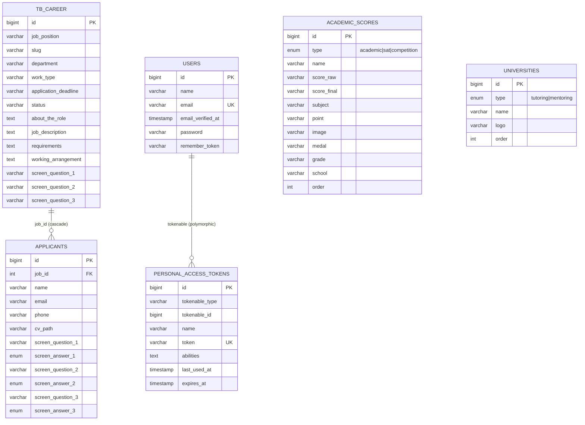
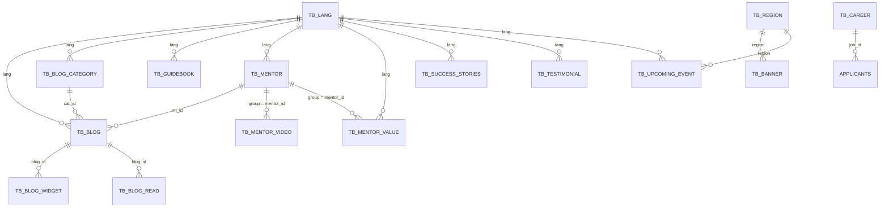

# 📋 Database Schema — EduALL Website

> Dokumentasi schema database yang disusun dari **tiga sumber**:
> 1. File migration — `src/database/migrations/`
> 2. Model Eloquent — `src/app/Models/` (tabel legacy `tb_*`)
> 3. Dump SQL — `migrate_allinedu.sql` / `db_niel.sql` (verifikasi tipe data legacy)
>
> - **Framework:** Laravel 9 (Eloquent ORM)
> - **Database:** MySQL / MariaDB
> - **Terakhir diperbarui:** 30 Agustus 2026 *(revisi 2 — + model Eloquent)*

---

## 📑 Daftar Isi

1. [Ringkasan Tabel](#️-ringkasan-tabel)
2. [Detail Tabel — dari Migration](#️-detail-tabel)
3. [Tabel Legacy via Model Eloquent (`tb_*`)](#-tabel-legacy-via-model-eloquent-tb_)
4. [Relasi Antar Tabel](#-relasi-antar-tabel)
5. [Catatan Penting](#️-catatan-penting)

---

## 🗂️ Ringkasan Tabel

Total **30 tabel** yang dipakai aplikasi: **8 dari migration** + **22 tabel
legacy `tb_*`** yang dikelola via model Eloquent.

### A. Tabel dari Migration (8)

| No | Tabel | File Migration | Model Eloquent | Keterangan |
|----|--------------------------|--------------------------------------------------------------|----------------|--------------------------------------------|
| 1 | `users` | `2014_10_12_000000_create_users_table.php` | `User` | User aplikasi (default Laravel) |
| 2 | `password_resets` | `2014_10_12_100000_create_password_resets_table.php` | — | Token reset password |
| 3 | `failed_jobs` | `2019_08_19_000000_create_failed_jobs_table.php` | — | Log job queue yang gagal |
| 4 | `personal_access_tokens` | `2019_12_14_000001_create_personal_access_tokens_table.php` | — (Sanctum) | API token (Laravel Sanctum) |
| 5 | `tb_career` | `2025_10_28_132456_...` *(ALTER)* + model | `Careers` | Lowongan karier *(dasar dibuat di luar migration)* |
| 6 | `applicants` | `2025_10_28_131926_create_applicants_table.php` | `Applicants` | Pelamar kerja per lowongan |
| 7 | `academic_scores` | `2025_11_19_114006_create_academic_scores_table.php` | `AcademicScore` | Nilai akademik / SAT / kompetisi |
| 8 | `universities` | `2025_11_20_141653_create_universities_table.php` | `University` | Universitas (tutoring/mentoring) |

### B. Tabel Legacy `tb_*` via Model Eloquent (22)

Keterangan kolom **Dump**: ✓ = ada di `migrate_allinedu.sql`; ✗ = *production-only*
(tidak ada di dump/migration); ⚠️ = struktur dump berbeda total dari model.

| No | Tabel | Model Eloquent | Dump | Keterangan |
|----|------------------------|---------------------|------|------------------------------------------------|
| 9 | `tb_banner` | `Banners` | ⚠️ | Banner homepage + statistik |
| 10 | `tb_blog` | `Blogs` | ✓ | Artikel blog |
| 11 | `tb_blog_category` | `BlogCategorys` | ✓ | Kategori blog |
| 12 | `tb_blog_read` | `BlogReads` | ✓ | Counter pembaca blog (per IP) |
| 13 | `tb_blog_widget` | `BlogWidgets` | ✓ | Widget CTA dalam artikel blog |
| 14 | `tb_as_seen` | `AsSeens` | ✗ | Logo media "as seen on" |
| 15 | `tb_contact` | `Contacts` | ✓ | Pesan contact form |
| 16 | `tb_guidebook` | `Guidebooks` | ✓ | Guidebook download |
| 17 | `tb_important_dates` | `ImportantDates` | ✗ | Agenda tanggal penting |
| 18 | `tb_lang` | `Languages` | ✓ | Master bahasa |
| 19 | `tb_mentor` | `Mentors` | ✓ | Profil mentor |
| 20 | `tb_mentor_value` | `MentorValues` | ✗ | Value mentor per bahasa |
| 21 | `tb_mentor_video` | `MentorVideos` | ✓ | Video mentor |
| 22 | `tb_project_showcase` | `ProjectShowcases` | ✓ | Portofolio project mentee |
| 23 | `tb_region` | `Regions` | ✓ | Master region |
| 24 | `tb_regular_talk` | `RegularTalks` | ✓ | Jadwal regular talk |
| 25 | `tb_success_stories` | `SuccessStories` | ✓ | Success story siswa |
| 26 | `tb_testimonial` | `Testimonials` | ✓ | Testimoni siswa/ortu |
| 27 | `tb_tutor` | `Tutors` | ✓ | Profil tutor |
| 28 | `tb_upcoming_event` | `UpcomingEvents` | ✓ | Agenda upcoming event |
| 29 | `tb_users` | `Users` | ✓ | User CMS/admin (≠ tabel `users`!) |
| 30 | `tb_website_settings` | `WebsiteSettings` | ✓ | Pengaturan website (single row) |

---

## 🗃️ Detail Tabel

### Konvensi Tipe

| Notasi Migration | Tipe MySQL | Keterangan |
|----------------------|------------------------|-------------------------------------|
| `$table->id()` | `BIGINT UNSIGNED` | Primary key, auto increment |
| `string()` | `VARCHAR(255)` | |
| `text()` | `TEXT` | |
| `longText()` | `LONGTEXT` | |
| `integer()` | `INT` | |
| `enum()` | `ENUM(...)` | Enum dengan daftar nilai terbatas |
| `timestamp()` | `TIMESTAMP` | |
| `timestamps()` | `TIMESTAMP NULL` ×2 | Menambah `created_at` & `updated_at` |
| `rememberToken()` | `VARCHAR(100) NULL` | Menambah kolom `remember_token` |
| `morphs()` | `VARCHAR(255)` + `BIGINT UNSIGNED` | Menambah `*_type` + `*_id` + index |

---

### 1. Tabel `users`

**File:** `2014_10_12_000000_create_users_table.php`

| Kolom | Tipe | Null | Default | Constraint / Index | Keterangan |
|--------------------|-----------------|------|---------|--------------------|-----------------------------|
| `id` | BIGINT UNSIGNED | NO | auto | **PRIMARY KEY** | |
| `name` | VARCHAR(255) | NO | — | | Nama user |
| `email` | VARCHAR(255) | NO | — | **UNIQUE** | Email login |
| `email_verified_at` | TIMESTAMP | YES | NULL | | Waktu verifikasi email |
| `password` | VARCHAR(255) | NO | — | | Password (hash) |
| `remember_token` | VARCHAR(100) | YES | NULL | | Token "remember me" |
| `created_at` | TIMESTAMP | YES | NULL | | |
| `updated_at` | TIMESTAMP | YES | NULL | | |

---

### 2. Tabel `password_resets`

**File:** `2014_10_12_100000_create_password_resets_table.php`

> ⚠️ Tabel ini **tidak memiliki primary key** maupun kolom `id`.

| Kolom | Tipe | Null | Default | Constraint / Index | Keterangan |
|------------|--------------|------|---------|--------------------|------------------------|
| `email` | VARCHAR(255) | NO | — | **INDEX** | Email pengirim request |
| `token` | VARCHAR(255) | NO | — | | Token reset password |
| `created_at` | TIMESTAMP | YES | NULL | | |

### 3. Tabel `failed_jobs`

**File:** `2019_08_19_000000_create_failed_jobs_table.php`

| Kolom | Tipe | Null | Default | Constraint / Index | Keterangan |
|-------------|-----------------|------|----------------------|--------------------|----------------------------------|
| `id` | BIGINT UNSIGNED | NO | auto | **PRIMARY KEY** | |
| `uuid` | VARCHAR(255) | NO | — | **UNIQUE** | Identitas unik job yang gagal |
| `connection` | TEXT | NO | — | | Koneksi queue |
| `queue` | TEXT | NO | — | | Nama queue |
| `payload` | LONGTEXT | NO | — | | Payload job (serialized) |
| `exception` | LONGTEXT | NO | — | | Stack trace error |
| `failed_at` | TIMESTAMP | NO | `CURRENT_TIMESTAMP` | | Waktu kegagalan |

---

### 4. Tabel `personal_access_tokens`

**File:** `2019_12_14_000001_create_personal_access_tokens_table.php`

> Tabel API token bawaan **Laravel Sanctum**. Relasi polymorphic ke model pemilik
> token (misal `App\Models\User`).

| Kolom | Tipe | Null | Default | Constraint / Index | Keterangan |
|------------------|-----------------|------|---------|------------------------------------------------|----------------------------|
| `id` | BIGINT UNSIGNED | NO | auto | **PRIMARY KEY** | |
| `tokenable_type` | VARCHAR(255) | NO | — | **INDEX** (`tokenable_type`, `tokenable_id`) | Nama class model pemilik |
| `tokenable_id` | BIGINT UNSIGNED | NO | — | **INDEX** (`tokenable_type`, `tokenable_id`) | ID model pemilik token |
| `name` | VARCHAR(255) | NO | — | | Nama device / token |
| `token` | VARCHAR(64) | NO | — | **UNIQUE** | Hash token API |
| `abilities` | TEXT | YES | NULL | | Daftar ability (JSON array) |
| `last_used_at` | TIMESTAMP | YES | NULL | | Terakhir dipakai |
| `expires_at` | TIMESTAMP | YES | NULL | | Waktu kedaluwarsa |
| `created_at` | TIMESTAMP | YES | NULL | | |
| `updated_at` | TIMESTAMP | YES | NULL | | |

---

### 5. Tabel `tb_career`

**File:** `2025_10_28_132456_add_screen_questions_to_tb_career_table.php` *(ALTER)*

> ⚠️ **Tabel ini tidak dibuat oleh migration manapun** di folder
> `src/database/migrations/` — tabel dasarnya dibuat manual / legacy langsung di
> database. Struktur kolom di bawah direkonstruksi dari model
> `App\Models\Careers` + migration ALTER. Kolom bertanda ❓ tidak terverifikasi
> dari migration (tipe data bersifat perkiraan).

| Kolom | Tipe | Null | Default | Constraint / Index | Keterangan |
|------------------------|---------------|------|---------|--------------------|--------------------------------------------------|
| `id` | INT (❓) | NO | auto | **PRIMARY KEY** | Direferensikan sebagai FK oleh `applicants.job_id` |
| `job_position` | VARCHAR (❓) | ❓ | — | | Nama posisi pekerjaan |
| `slug` | VARCHAR (❓) | ❓ | — | | Slug URL lowongan |
| `department` | VARCHAR (❓) | ❓ | — | | Departemen |
| `work_type` | VARCHAR (❓) | ❓ | — | | Tipe kerja (full-time, dll.) |
| `application_deadline` | VARCHAR/DATE (❓) | ❓ | — | | Batas waktu lamaran |
| `status` | VARCHAR (❓) | ❓ | — | | Status lowongan |
| `about_the_role` | TEXT (❓) | ❓ | — | | Deskripsi peran |
| `job_description` | TEXT (❓) | ❓ | — | | Deskripsi pekerjaan |
| `requirements` | TEXT (❓) | ❓ | — | | Requirement pelamar |
| `working_arrangement` | TEXT (❓) | ❓ | — | | Pengaturan kerja (WFH/WFO) |
| `screen_question_1` | VARCHAR(255) | YES | NULL | | Pertanyaan screening 1 *(ditambah migration)* |
| `screen_question_2` | VARCHAR(255) | YES | NULL | | Pertanyaan screening 2 *(ditambah migration)* |
| `screen_question_3` | VARCHAR(255) | YES | NULL | | Pertanyaan screening 3 *(ditambah migration)* |
| `created_at` | TIMESTAMP | ❓ | — | | |
| `updated_at` | TIMESTAMP | ❓ | — | | |

### 6. Tabel `applicants`

**File:** `2025_10_28_131926_create_applicants_table.php`

> Menyimpan data pelamar kerja, termasuk jawaban yes/no atas pertanyaan
> screening yang di-copy dari `tb_career` saat melamar.
>
> ⚠️ Kolom `utm_code` ada di `$fillable` model `App\Models\Applicants` tetapi
> **tidak dibuat oleh migration** — kemungkinan ditambah manual di DB production.

| Kolom | Tipe | Null | Default | Constraint / Index | Keterangan |
|---------------------|-----------------|------|---------|-----------------------------------------------|--------------------------------------------|
| `id` | BIGINT UNSIGNED | NO | auto | **PRIMARY KEY** | |
| `job_id` | INT | NO | — | **FOREIGN KEY** → `tb_career(id)` ON DELETE CASCADE | Lowongan yang dilamar |
| `name` | VARCHAR(255) | NO | — | | Nama pelamar |
| `email` | VARCHAR(255) | NO | — | | Email pelamar |
| `phone` | VARCHAR(255) | YES | NULL | | No. telepon pelamar |
| `cv_path` | VARCHAR(255) | YES | NULL | | Path file CV yang di-upload |
| `screen_question_1` | VARCHAR(255) | YES | NULL | | Pertanyaan screening 1 (snapshot) |
| `screen_answer_1` | ENUM('yes','no') | YES | NULL | | Jawaban pertanyaan 1 |
| `screen_question_2` | VARCHAR(255) | YES | NULL | | Pertanyaan screening 2 (snapshot) |
| `screen_answer_2` | ENUM('yes','no') | YES | NULL | | Jawaban pertanyaan 2 |
| `screen_question_3` | VARCHAR(255) | YES | NULL | | Pertanyaan screening 3 (snapshot) |
| `screen_answer_3` | ENUM('yes','no') | YES | NULL | | Jawaban pertanyaan 3 |
| `utm_code` | VARCHAR(255) ❓ | YES ❓ | NULL ❓ | | Kode UTM tracking *(model saja — tidak ada di migration)* |
| `created_at` | TIMESTAMP | YES | NULL | | |
| `updated_at` | TIMESTAMP | YES | NULL | | |

---

### 7. Tabel `academic_scores`

**File:** `2025_11_19_114006_create_academic_scores_table.php`

> Menyimpan nilai akademik siswa untuk ditampilkan di website (report card,
> SAT, hasil kompetisi). Urutan tampil dikontrol manual lewat kolom `order`.

| Kolom | Tipe | Null | Default | Constraint / Index | Keterangan |
|---------------|-----------------|------|-----------|--------------------|-----------------------------------------|
| `id` | BIGINT UNSIGNED | NO | auto | **PRIMARY KEY** | |
| `type` | ENUM('academic','sat','competition') | NO | `'academic'` | | Kategori nilai |
| `name` | VARCHAR(255) | NO | — | | Nama item (mapel / tes / lomba) |
| `score_raw` | VARCHAR(255) | YES | NULL | | Nilai mentah, cth: `5`, `B`, `68`, `C`, `7` |
| `score_final` | VARCHAR(255) | YES | NULL | | Nilai akhir, cth: `6`, `B`, `71`, `A*` |
| `subject` | VARCHAR(255) | YES | NULL | | Mata pelajaran |
| `point` | VARCHAR(255) | YES | NULL | | Poin / nilai konversi |
| `image` | VARCHAR(255) | YES | NULL | | Path gambar (sertifikat / rapor) |
| `medal` | VARCHAR(255) | YES | NULL | | Medali (untuk type competition) |
| `grade` | VARCHAR(255) | YES | NULL | | Jenjang kelas |
| `school` | VARCHAR(255) | YES | NULL | | Nama sekolah |
| `order` | INT | NO | `0` | | Urutan tampil manual |
| `created_at` | TIMESTAMP | YES | NULL | | |
| `updated_at` | TIMESTAMP | YES | NULL | | |

### 8. Tabel `universities`

**File:** `2025_11_20_141653_create_universities_table.php`

> Daftar universitas tujuan alumni untuk section program *tutoring* /
> *mentoring*.

| Kolom | Tipe | Null | Default | Constraint / Index | Keterangan |
|-------------|-----------------|------|-------------|--------------------|--------------------------------------|
| `id` | BIGINT UNSIGNED | NO | auto | **PRIMARY KEY** | |
| `type` | ENUM('tutoring','mentoring') | NO | `'tutoring'` | | Kategori program |
| `name` | VARCHAR(255) | NO | — | | Nama universitas |
| `logo` | VARCHAR(255) | NO | — | | Path logo universitas |
| `order` | INT | NO | — | | Urutan tampil (tanpa default) |
| `created_at` | TIMESTAMP | YES | NULL | | |
| `updated_at` | TIMESTAMP | YES | NULL | | |

---

## 🧩 Tabel Legacy via Model Eloquent (`tb_*`)

22 tabel berikut **tidak dibuat oleh migration** — dikelola langsung lewat
model Eloquent di `src/app/Models/`. Tipe data diverifikasi terhadap dump
`migrate_allinedu.sql`; tabel bertanda *production-only* tidak ada di dump
maupun migration.

> **Pola `group` + `lang` (multibahasa):** satu konten disimpan beberapa baris
> (satu per bahasa) yang berbagi nilai `group` yang sama; kolom `lang`
> (`CHAR(2)`) merujuk ke `tb_lang.language_id`. Berlaku untuk: `tb_blog_category`,
> `tb_guidebook`, `tb_mentor`, `tb_mentor_value`, `tb_success_stories`,
> `tb_testimonial`, `tb_upcoming_event` (+ `tb_banner` di dump lama).
>
> **Konvensi legacy:** PK `id` = `INT(11)` auto increment; timestamp default
> `'0000-00-00 00:00:00'` (mode SQL lama); charset umumnya `latin1`.

### 9. Tabel `tb_banner` — Model: `App\Models\Banners`

**Sumber:** ⚠️ **Model saja.** Struktur `tb_banner` di dump lama *berbeda total*
(pakai `banner_img`, `banner_img_mobile`, `banner_title`, `banner_button`, … —
versi "allinedu" lama) sehingga tidak dijadikan referensi. Tipe data = perkiraan.

| Kolom | Tipe (perkiraan) | Keterangan |
|--------------------------|------------------|----------------------------------------------|
| `id` | INT, PK auto | |
| `image` | VARCHAR/TEXT | Gambar banner |
| `video_link` | VARCHAR/TEXT | Link video banner |
| `alt` | VARCHAR(255) | Alt text gambar |
| `accepatance` | VARCHAR/INT | Statistik *acceptance* (typo di model) |
| `mentees` | INT/VARCHAR | Statistik jumlah mentee |
| `scholarship` | INT/VARCHAR | Statistik beasiswa |
| `sat_score` | VARCHAR/INT | Statistik rata-rata skor SAT |
| `statisfaction_rate` | VARCHAR/INT | Statistik *satisfaction rate* (typo di model) |
| `created_at`, `updated_at` | TIMESTAMP | |

**Relasi:** `regions()` & `languages()` (belongsTo) — kolom `region`/`lang`
tidak ada di `$fillable` versi model saat ini.

### 10. Tabel `tb_blog` — Model: `App\Models\Blogs`

**Sumber:** model + dump ✓ *(model menambah `old_slug`)*

| Kolom | Tipe DB | Keterangan |
|----------------------------|--------------------------|-----------------------------------|
| `id` | INT(11), PK auto | |
| `slug` | TEXT | Slug artikel |
| `old_slug` | — *(baru di model)* | Slug lama (redirect/SEO) |
| `cat_id` | INT(11) | → `tb_blog_category.id` |
| `mt_id` | INT(11) NULL | → `tb_mentor.id` (penulis) |
| `blog_title` | VARCHAR(255) | Judul artikel |
| `blog_description` | TEXT | Isi artikel (HTML) |
| `blog_thumbnail` | TEXT | Gambar thumbnail |
| `blog_thumbnail_alt` | VARCHAR(255) | Alt text thumbnail |
| `blog_status` | ENUM('draft','publish') | Status publikasi |
| `seo_title` | TEXT | Judul SEO |
| `seo_keyword` | TEXT | Keyword SEO |
| `seo_desc` | TEXT | Deskripsi SEO |
| `lang` | CHAR(2) | → `tb_lang.language_id` |
| `click_count` | INT(11) | Jumlah klik |
| `duration_read` | VARCHAR(255) | Estimasi waktu baca |
| `is_highlight` | ENUM('true','false') | Ditampilkan sebagai highlight |
| `publish_date` | TIMESTAMP NULL | Tanggal publikasi |
| `created_at`, `updated_at` | TIMESTAMP | |

**Relasi:** `blog_category()`, `mentor()`, `languages()` (belongsTo);
`blog_widget()`, `blog_read()` (hasMany).

### 11. Tabel `tb_blog_category` — Model: `App\Models\BlogCategorys`

**Sumber:** model + dump ✓ *(match)*

| Kolom | Tipe DB | Keterangan |
|----------------------------|--------------|-------------------------------|
| `id` | INT(11), PK auto | |
| `group` | BIGINT(20) | Key grouping antar bahasa |
| `category_name` | VARCHAR(255) | Nama kategori |
| `slug` | VARCHAR(255) | Slug kategori |
| `lang` | CHAR(2) | → `tb_lang.language_id` |
| `created_at`, `updated_at` | TIMESTAMP | |

**Relasi:** `blog()` hasMany → `tb_blog.cat_id`; `languages()` belongsTo.

### 12. Tabel `tb_blog_read` — Model: `App\Models\BlogReads`

**Sumber:** model + dump ✓ *(match)*

| Kolom | Tipe DB | Keterangan |
|----------------------------|--------------|------------------------------|
| `id` | INT(11), PK auto | |
| `ip_address` | VARCHAR(255) | IP pembaca (dedup view) |
| `blog_id` | INT(11) | → `tb_blog.id` |
| `created_at`, `updated_at` | TIMESTAMP | |

**Relasi:** `blog()` belongsTo → `tb_blog`.

### 13. Tabel `tb_blog_widget` — Model: `App\Models\BlogWidgets`

**Sumber:** model + dump ✓ *(dump punya `image` & `position` yang tidak ada di `$fillable`)*

| Kolom | Tipe DB | Keterangan |
|----------------------------|---------------------|-------------------------------|
| `id` | INT(11), PK auto | |
| `blog_id` | INT(11) | → `tb_blog.id` |
| `title` | VARCHAR(255) | Judul widget |
| `description` | TEXT | Deskripsi widget |
| `link` | TEXT | URL tujuan |
| `image` | VARCHAR(255) NULL | Gambar widget *(dump saja)* |
| `button_name` | VARCHAR(255) NULL | Label tombol |
| `position` | INT(11) | Urutan tampil *(dump saja)* |
| `created_at`, `updated_at` | TIMESTAMP | |

**Relasi:** `blog()` belongsTo → `tb_blog`.

### 14. Tabel `tb_as_seen` — Model: `App\Models\AsSeens`

**Sumber:** ⚠️ **Model saja** — *production-only* (tidak ada di dump/migration).

| Kolom | Tipe (perkiraan) | Keterangan |
|----------------------------|------------------|------------------------------|
| `id` | INT, PK auto | |
| `thumbnail` | VARCHAR/TEXT | Logo media "as seen on" |
| `alt` | VARCHAR(255) | Alt text |
| `created_at`, `updated_at` | TIMESTAMP | |

### 15. Tabel `tb_contact` — Model: `App\Models\Contacts`

**Sumber:** model + dump ✓ *(match)*

| Kolom | Tipe DB | Keterangan |
|----------------------------|--------------|------------------|
| `id` | INT(11), PK auto | |
| `name` | VARCHAR(255) | Nama pengirim |
| `email` | VARCHAR(255) | Email pengirim |
| `message` | TEXT | Isi pesan |
| `created_at`, `updated_at` | TIMESTAMP | |

### 16. Tabel `tb_guidebook` — Model: `App\Models\Guidebooks`

**Sumber:** model + dump ✓ *(match)*

| Kolom | Tipe DB | Keterangan |
|----------------------------|---------------------------|-------------------------|
| `id` | INT(11), PK auto | |
| `group` | BIGINT(20) | Key grouping antar bahasa |
| `guidebook_category` | VARCHAR(255) | Kategori guidebook |
| `guidebook_image` | TEXT | Gambar cover |
| `guidebook_alt` | VARCHAR(255) | Alt text |
| `guidebook_link` | TEXT | Link download |
| `guidebook_status` | ENUM('active','inactive') | Status tampil |
| `lang` | CHAR(2) | → `tb_lang.language_id` |
| `created_at`, `updated_at` | TIMESTAMP | |

**Relasi:** `languages()` belongsTo.

### 17. Tabel `tb_important_dates` — Model: `App\Models\ImportantDates`

**Sumber:** ⚠️ **Model saja** — *production-only*.

| Kolom | Tipe (perkiraan) | Keterangan |
|----------------------------|------------------|-----------------------|
| `id` | INT, PK auto | |
| `title` | VARCHAR(255) | Judul agenda |
| `date` | DATE/VARCHAR | Tanggal |
| `link` | VARCHAR/TEXT | Link terkait |
| `created_at`, `updated_at` | TIMESTAMP | |

### 18. Tabel `tb_lang` — Model: `App\Models\Languages`

**Sumber:** model + dump ✓ *(match)*

| Kolom | Tipe DB | Keterangan |
|-------------|------------------|--------------------------------|
| `id` | INT(11), PK auto | |
| `language_id` | CHAR(2) | Kode bahasa (`en`, `id`, …) |
| `language` | VARCHAR(255) | Nama bahasa |

> Tanpa `created_at` / `updated_at`. Master referensi untuk semua kolom `lang`.

### 19. Tabel `tb_mentor` — Model: `App\Models\Mentors`

**Sumber:** model + dump ✓ *(model menambah `value_1..3`; dump punya `meta_title`, `meta_desc`)*

| Kolom | Tipe DB | Keterangan |
|----------------------------|---------------------------|---------------------------------------|
| `id` | INT(11), PK auto | |
| `group` | BIGINT(20) | Key grouping antar bahasa |
| `mentor_fullname` | VARCHAR(255) | Nama lengkap |
| `mentor_slug` | VARCHAR(255) | Slug profil |
| `mentor_category` | VARCHAR(255) | Kategori mentor |
| `mentor_graduation` | TEXT | Riwayat pendidikan |
| `currently_working` | TEXT NULL | Pekerjaan saat ini |
| `expertise` | TEXT NULL | Keahlian |
| `description` | TEXT | Deskripsi lengkap |
| `short_desc` | TEXT | Deskripsi singkat |
| `mentor_picture` | TEXT | Foto |
| `mentor_alt` | VARCHAR(255) | Alt text foto |
| `mentor_status` | ENUM('active','inactive') | Status tampil |
| `value_1` .. `value_3` | — *(baru di model)* | 3 poin *value* mentor |
| `lang` | CHAR(2) | → `tb_lang.language_id` |
| `meta_title` | TEXT NULL | SEO title *(dump saja)* |
| `meta_desc` | TEXT NULL | SEO description *(dump saja)* |
| `created_at`, `updated_at` | TIMESTAMP | |

**Relasi:** `mentor_video()`, `mentor_value()` (hasMany via `group`);
`blog()` (hasMany via `mt_id`); `languages()` belongsTo.

### 20. Tabel `tb_mentor_value` — Model: `App\Models\MentorValues`

**Sumber:** ⚠️ **Model saja** — *production-only*.

| Kolom | Tipe (perkiraan) | Keterangan |
|----------------------------|------------------|----------------------------|
| `id` | INT, PK auto | |
| `mentor_id` | INT/BIGINT | → `tb_mentor.group` |
| `lang` | CHAR(2) | → `tb_lang.language_id` |
| `group` | BIGINT | Key grouping antar bahasa |
| `value` | VARCHAR/TEXT | Teks *value* mentor |
| `created_at`, `updated_at` | TIMESTAMP | |

**Relasi:** `mentor()` belongsTo ⚠️ (definisi di model memetakan `group` →
`mentor_id`, kolom yang tidak ada di `tb_mentor` — kemungkinan bug);
`languages()` belongsTo.

### 21. Tabel `tb_mentor_video` — Model: `App\Models\MentorVideos`

**Sumber:** model + dump ✓ *(match)*

| Kolom | Tipe DB | Keterangan |
|----------------------------|--------------|-----------------------------|
| `id` | INT(11), PK auto | |
| `mentor_id` | BIGINT(20) | → `tb_mentor.group` |
| `video_embed` | TEXT | Kode embed video |
| `youtube_id` | TEXT | ID YouTube |
| `description` | TEXT | Deskripsi video |
| `created_at`, `updated_at` | TIMESTAMP | |

**Relasi:** `mentor()` belongsTo ⚠️ (idem); akses benar dari sisi
`Mentors::mentor_video()` yang memakai `mentor_id = tb_mentor.group`.

### 22. Tabel `tb_project_showcase` — Model: `App\Models\ProjectShowcases`

**Sumber:** model + dump ✓ *(match)*

| Kolom | Tipe DB | Keterangan |
|----------------------------|---------------------------|--------------------------|
| `id` | INT(11), PK auto | |
| `name` | VARCHAR(255) | Nama mentee |
| `category` | VARCHAR(255) | Kategori project |
| `project_name` | VARCHAR(255) | Judul project |
| `description` | TEXT | Deskripsi |
| `thumbnail` | TEXT | Gambar utama |
| `alt` | VARCHAR(255) | Alt text |
| `gallery` | TEXT | Galeri (list path) |
| `status` | ENUM('active','inactive') | Status tampil |
| `created_at`, `updated_at` | TIMESTAMP | |

### 23. Tabel `tb_region` — Model: `App\Models\Regions`

**Sumber:** model + dump ✓ *(match)*

| Kolom | Tipe DB | Keterangan |
|-----------|------------------|------------------------------|
| `id` | INT(11), PK auto | |
| `region_id` | CHAR(2) | Kode region |
| `region` | VARCHAR(255) | Nama region |

> Tanpa `created_at` / `updated_at`. Master referensi untuk kolom `region`.

### 24. Tabel `tb_regular_talk` — Model: `App\Models\RegularTalks`

**Sumber:** model + dump ✓ *(match)*

| Kolom | Tipe DB | Keterangan |
|----------------------------|-----------------|----------------------------|
| `id` | INT(11), PK auto | |
| `topic` | VARCHAR(255) | Topik talk |
| `topic_slug` | VARCHAR(255) | Slug topik |
| `date` | DATE | Tanggal acara |
| `time` | TIME | Waktu acara |
| `recommended_for` | VARCHAR(15) | Target audiens |
| `form_link` | TEXT | Link pendaftaran |
| `description` | TEXT | Deskripsi |
| `key_takeaways` | TEXT | Poin pembelajaran |
| `speaker_image` | TEXT | Foto pembicara |
| `status` | VARCHAR(10) | Status |
| `created_at`, `updated_at` | TIMESTAMP NULL | |

### 25. Tabel `tb_success_stories` — Model: `App\Models\SuccessStories`

**Sumber:** model + dump ✓ *(model menambah `category` & `summary_description`; dump punya `badge_3`, `badge_4`)*

| Kolom | Tipe DB | Keterangan |
|----------------------------|---------------------------|--------------------------|
| `id` | INT(11), PK auto | |
| `group` | BIGINT(20) | Key grouping antar bahasa |
| `name` | VARCHAR(255) | Nama siswa/alumni |
| `category` | — *(baru di model)* | Kategori story |
| `badge_1`, `badge_2` | VARCHAR(255) | Badge pencapaian |
| `badge_3`, `badge_4` | VARCHAR(255) NULL | Badge tambahan *(dump saja)* |
| `summary_description` | — *(baru di model)* | Ringkasan cerita |
| `description` | TEXT | Cerita lengkap |
| `status` | ENUM('active','inactive') | Status tampil |
| `thumbnail` | TEXT | Foto profil |
| `thumbnail_alt` | VARCHAR(255) | Alt text |
| `achievement_image` | TEXT | Gambar pencapaian |
| `achievement_alt` | VARCHAR(255) | Alt text |
| `video_link` | TEXT | Link video |
| `lang` | CHAR(2) | → `tb_lang.language_id` |
| `created_at`, `updated_at` | TIMESTAMP | |

**Relasi:** `languages()` belongsTo.

### 26. Tabel `tb_testimonial` — Model: `App\Models\Testimonials`

**Sumber:** model + dump ✓ *(match)*

| Kolom | Tipe DB | Keterangan |
|----------------------------|---------------------------|--------------------------|
| `id` | INT(11), PK auto | |
| `group` | BIGINT(20) | Key grouping antar bahasa |
| `testi_name` | VARCHAR(255) | Nama pemberi testimoni |
| `testi_desc` | TEXT | Isi testimoni |
| `testi_subtitle` | VARCHAR(255) NULL | Subjudul |
| `testi_category` | VARCHAR(255) | Kategori |
| `testi_subcategory` | VARCHAR(255) NULL | Sub-kategori |
| `testi_thumbnail` | TEXT | Foto |
| `testi_alt` | VARCHAR(255) | Alt text |
| `testi_status` | ENUM('active','inactive') | Status tampil |
| `lang` | CHAR(2) | → `tb_lang.language_id` |
| `created_at`, `updated_at` | TIMESTAMP | |

**Relasi:** `languages()` belongsTo.

### 27. Tabel `tb_tutor` — Model: `App\Models\Tutors`

**Sumber:** model + dump ✓ *(dump punya `status` yang tidak ada di `$fillable`)*

| Kolom | Tipe DB | Keterangan |
|----------------------------|---------------------------|------------------|
| `id` | INT(11), PK auto | |
| `full_name` | VARCHAR(255) | Nama tutor |
| `experience` | VARCHAR(255) | Pengalaman |
| `subject` | TEXT | Mapel yang diajar |
| `thumbnail` | TEXT | Foto |
| `alt` | VARCHAR(255) | Alt text |
| `status` | ENUM('active','inactive') | Status *(dump saja)* |
| `created_at`, `updated_at` | TIMESTAMP | |

### 28. Tabel `tb_upcoming_event` — Model: `App\Models\UpcomingEvents`

**Sumber:** model + dump ✓ *(model menambah `category`; dump punya `region`, `publish_date`, `take_off_date`)*

| Kolom | Tipe DB | Keterangan |
|----------------------------|---------------------------|---------------------------------------------|
| `id` | INT(11), PK auto | |
| `group` | BIGINT(20) | Key grouping antar bahasa |
| `category` | — *(baru di model)* | Kategori event |
| `event_date` | VARCHAR(255) | Tanggal acara (teks bebas) |
| `event_thumbnail` | VARCHAR(255) | Gambar event |
| `event_alt` | VARCHAR(255) | Alt text |
| `event_title` | VARCHAR(255) | Judul |
| `event_subtitle` | VARCHAR(255) | Subjudul |
| `event_detail` | TEXT | Detail acara |
| `event_rsvp_link` | TEXT NULL | Link RSVP |
| `event_status` | ENUM('draft','publish') | Status |
| `region` | CHAR(2) | → `tb_region.region_id` *(dump saja)* |
| `lang` | CHAR(2) | → `tb_lang.language_id` |
| `publish_date` | DATE | Mulai tampil *(dump saja)* |
| `take_off_date` | DATE | Tanggal dihapus dari list *(dump saja)* |
| `created_at`, `updated_at` | TIMESTAMP | |

**Relasi:** `regions()`, `languages()` belongsTo.

### 29. Tabel `tb_users` — Model: `App\Models\Users`

**Sumber:** model + dump ✓ *(match)*

| Kolom | Tipe DB | Keterangan |
|----------------------------|--------------|-------------------------|
| `id` | INT(11), PK auto | |
| `name` | VARCHAR(255) | Nama |
| `email` | VARCHAR(255) | Email login CMS |
| `password` | TEXT | Password (hash) |
| `created_at`, `updated_at` | TIMESTAMP | |

> ⚠️ **Berbeda dari tabel `users`** (hasil migration). Dua model mengarah ke dua
> tabel login yang berbeda: `App\Models\User` → `users`, sedangkan
> `App\Models\Users` → `tb_users`.

### 30. Tabel `tb_website_settings` — Model: `App\Models\WebsiteSettings`

**Sumber:** model + dump ✓ *(match)*

| Kolom | Tipe DB | Keterangan |
|---------------------------|------------------|---------------------------------|
| `id` | INT(11), PK auto | |
| `website_name` | VARCHAR(255) | Nama website |
| `website_primary_logo` | TEXT | Logo utama |
| `alt_primary_logo` | VARCHAR(255) | Alt text |
| `website_secondary_logo` | TEXT NULL | Logo sekunder |
| `alt_secondary_logo` | VARCHAR(255) NULL | Alt text |
| `phone_number_wa` | BIGINT(20) | No. WhatsApp |
| `phone_number_1..3` | BIGINT(20) | No. telepon (2 & 3 nullable) |
| `address` | TEXT | Alamat |
| `email` | TEXT | Email kontak |
| `linkedin` | TEXT | URL LinkedIn |
| `instagram` | TEXT | URL Instagram |
| `youtube_channel` | TEXT | URL YouTube |
| `created_at`, `updated_at` | TIMESTAMP | |

> Tipe konfigurasi *single-row* — umumnya hanya berisi 1 baris.

---

## 🔗 Relasi Antar Tabel

### A. Relasi FK Basis Data (Migration)

```
┌──────────────────┐          ┌──────────────────────┐
│    tb_career     │          │  personal_access_    │
│  (id, PK)        │          │      tokens          │
└────────┬─────────┘          │  tokenable_type      │──┐ polymorphic
         │ 1                  │  tokenable_id        │  │ (users, ...)
         │                    └──────────────────────┘  │
         │ N                                            ▼
┌────────▼─────────┐          ┌──────────────────────┐   ┌────────┐
│    applicants    │          │   academic_scores    │   │ users  │
│  job_id (FK)     │          │  (standalone)        │   └────────┘
└──────────────────┘          └──────────────────────┘

┌──────────────────────┐       ┌──────────────────────┐
│    universities      │       │   failed_jobs        │
│    (standalone)      │       │   password_resets    │
└──────────────────────┘       └──────────────────────┘
```

| Relasi | Kardinalitas | Mekanisme | Keterangan |
|--------------------------------------|--------------|----------------------------------|------------|
| `tb_career` → `applicants` | 1 : N | FK `applicants.job_id` → `tb_career.id`, `ON DELETE CASCADE` | Satu lowongan punya banyak pelamar; lowongan dihapus → pelamar ikut terhapus |
| `users` → `personal_access_tokens` | 1 : N | Polymorphic (`tokenable_type` + `tokenable_id`) | Sanctum API token |

### B. Peta Relasi Eloquent (Legacy `tb_*`)

> Relasi legacy **tidak ditegakkan FK di level database** — hanya didefinisikan
> di model Eloquent.

| Model (dari) | Method Relasi | Tipe | Kunci Join |
|------------------|------------------|------------|------------------------------------------------|
| `Blogs` | `blog_category()` | belongsTo | `tb_blog.cat_id` → `tb_blog_category.id` |
| `Blogs` | `mentor()` | belongsTo | `tb_blog.mt_id` → `tb_mentor.id` |
| `Blogs` | `languages()` | belongsTo | `tb_blog.lang` → `tb_lang.language_id` |
| `Blogs` | `blog_widget()` | hasMany | `tb_blog_widget.blog_id` → `tb_blog.id` |
| `Blogs` | `blog_read()` | hasMany | `tb_blog_read.blog_id` → `tb_blog.id` |
| `BlogCategorys` | `blog()` | hasMany | `tb_blog.cat_id` → `tb_blog_category.id` |
| `BlogCategorys` | `languages()` | belongsTo | `lang` → `tb_lang.language_id` |
| `BlogReads` | `blog()` | belongsTo | `blog_id` → `tb_blog.id` |
| `BlogWidgets` | `blog()` | belongsTo | `blog_id` → `tb_blog.id` |
| `Banners` | `regions()` | belongsTo | `region` → `tb_region.region_id` |
| `Banners` | `languages()` | belongsTo | `lang` → `tb_lang.language_id` |
| `Guidebooks` | `languages()` | belongsTo | `lang` → `tb_lang.language_id` |
| `Mentors` | `mentor_video()` | hasMany | `tb_mentor_video.mentor_id` → `tb_mentor.group` |
| `Mentors` | `mentor_value()` | hasMany | `tb_mentor_value.mentor_id` → `tb_mentor.group` (+ filter `lang`) |
| `Mentors` | `blog()` | hasMany | `tb_blog.mt_id` → `tb_mentor.id` |
| `Mentors` | `languages()` | belongsTo | `lang` → `tb_lang.language_id` |
| `MentorValues` | `mentor()` ⚠️ | belongsTo | `group` → `tb_mentor.mentor_id` *(kolom tidak ada di `tb_mentor` — kemungkinan bug)* |
| `MentorValues` | `languages()` | belongsTo | `lang` → `tb_lang.language_id` |
| `MentorVideos` | `mentor()` ⚠️ | belongsTo | `group` → `tb_mentor.mentor_id` *(idem)* |
| `SuccessStories` | `languages()` | belongsTo | `lang` → `tb_lang.language_id` |
| `Testimonials` | `languages()` | belongsTo | `lang` → `tb_lang.language_id` |
| `UpcomingEvents` | `regions()` | belongsTo | `region` → `tb_region.region_id` |
| `UpcomingEvents` | `languages()` | belongsTo | `lang` → `tb_lang.language_id` |
| `Applicants` | `career()` | belongsTo | `job_id` → `tb_career.id` |
| `Careers` | `applicants()` | hasMany | `applicants.job_id` → `tb_career.id` |
| `AcademicScore` | — | standalone | — |
| `University` | — | standalone | — |

### Diagram ERD (Mermaid)



---

### Diagram ERD Legacy (Mermaid)



---

## ⚠️ Catatan Penting

1. **`tb_career` tidak dibuat oleh migration.** Migration di folder ini hanya
   *menambah kolom* `screen_question_1..3` ke tabel tersebut. Tabel dasarnya
   dibuat manual/legacy langsung di database production (juga tidak ditemukan di
   dump `db_niel.sql` maupun `migrate_allinedu.sql`). Struktur kolom pada
   dokumen ini direkonstruksi dari model `App\Models\Careers` — sebaiknya
   dibuatkan migration `create_tb_career_table` agar environment baru bisa
   `migrate:fresh` tanpa import manual.
2. **Snapshot jawaban screening.** Tabel `applicants` menyimpan *copy* teks
   pertanyaan screening saat pelamar mendaftar, sehingga perubahan pertanyaan di
   `tb_career` tidak memengaruhi data pelamar yang lama.
3. **Ketidakcocokan tipe FK (potensi isu):** `applicants.job_id` bertipe `INT`
   sementara PK bawaan `$table->id()` adalah `BIGINT UNSIGNED`. Aman selama
   `tb_career.id` juga `INT`, tetapi perlu diverifikasi bila `tb_career.id`
   ternyata `BIGINT UNSIGNED`.
4. **`password_resets` tanpa primary key** — mengikuti konvensi default Laravel
   lama; baris lama biasanya dibersihkan berkala berdasarkan `created_at`.
5. **22 tabel legacy `tb_*` dikelola via model Eloquent, bukan migration.**
   Strukturnya ada di dump `migrate_allinedu.sql` / `db_niel.sql` — jalankan
   dump tersebut terlebih dahulu sebelum `php artisan migrate`. Lihat section
   [Tabel Legacy via Model Eloquent](#-tabel-legacy-via-model-eloquent-tb_).
6. **Urutan migration** mengikuti timestamp nama file. `applicants` (`131926`)
   dijalankan *sebelum* ALTER `tb_career` (`132456`) — keduanya aman karena FK
   hanya membutuhkan keberadaan tabel `tb_career`, bukan kolom screen question.
7. **Model terkait (28 model, 1:1 per tabel):**
   - Migration: `User` → `users`; `Careers` → `tb_career`; `Applicants` →
     `applicants`; `AcademicScore` → `academic_scores`; `University` → `universities`
   - Legacy: `Banners`, `Blogs`, `BlogCategorys`, `BlogReads`, `BlogWidgets`,
     `AsSeens`, `Contacts`, `Guidebooks`, `ImportantDates`, `Languages`,
     `Mentors`, `MentorValues`, `MentorVideos`, `ProjectShowcases`, `Regions`,
     `RegularTalks`, `SuccessStories`, `Testimonials`, `Tutors`,
     `UpcomingEvents`, `Users`, `WebsiteSettings`
8. **Divergensi dump vs model** (dump = versi lama "allinedu", production DB
   kemungkinan sudah berubah — verifikasi ke DB langsung bila kritis):
   - `tb_banner`: struktur dump **berbeda total** dari model (`banner_img`,
     `banner_title`, … vs `image`, `video_link`, `accepatance`, …)
   - Kolom *baru di model* (tidak ada di dump): `tb_blog.old_slug`,
     `tb_mentor.value_1..3`, `tb_success_stories.category` & `summary_description`,
     `tb_upcoming_event.category`
   - Kolom *hanya di dump* (tidak di `$fillable`): `tb_blog_widget.image` &
     `position`, `tb_mentor.meta_title` & `meta_desc`,
     `tb_success_stories.badge_3/4`, `tb_tutor.status`,
     `tb_upcoming_event.region` / `publish_date` / `take_off_date`
9. **Tabel *production-only*** — tidak ada di dump maupun migration:
   `tb_career`, `tb_as_seen`, `tb_mentor_value`, `tb_important_dates`.
   Sebaiknya dibuatkan migration agar environment baru bisa `migrate:fresh`.
10. **`Applicants.utm_code`** ada di `$fillable` model tetapi tidak dibuat oleh
    migration — kolom kemungkinan ditambah manual di DB production.
11. **Pola multibahasa:** konten disimpan per bahasa dengan key `group` yang
    sama + kolom `lang` → `tb_lang.language_id` (tidak ada FK di DB).
12. **Konvensi legacy:** PK `INT(11)` (bukan BIGINT), timestamp default
    `'0000-00-00 00:00:00'` butuh SQL mode lama, charset umumnya `latin1`.
13. **Dua model login berbeda:** `App\Models\User` → tabel `users` (migration),
    `App\Models\Users` → tabel `tb_users` (CMS). Jangan tertukar — keduanya
    extends `Authenticatable`.


